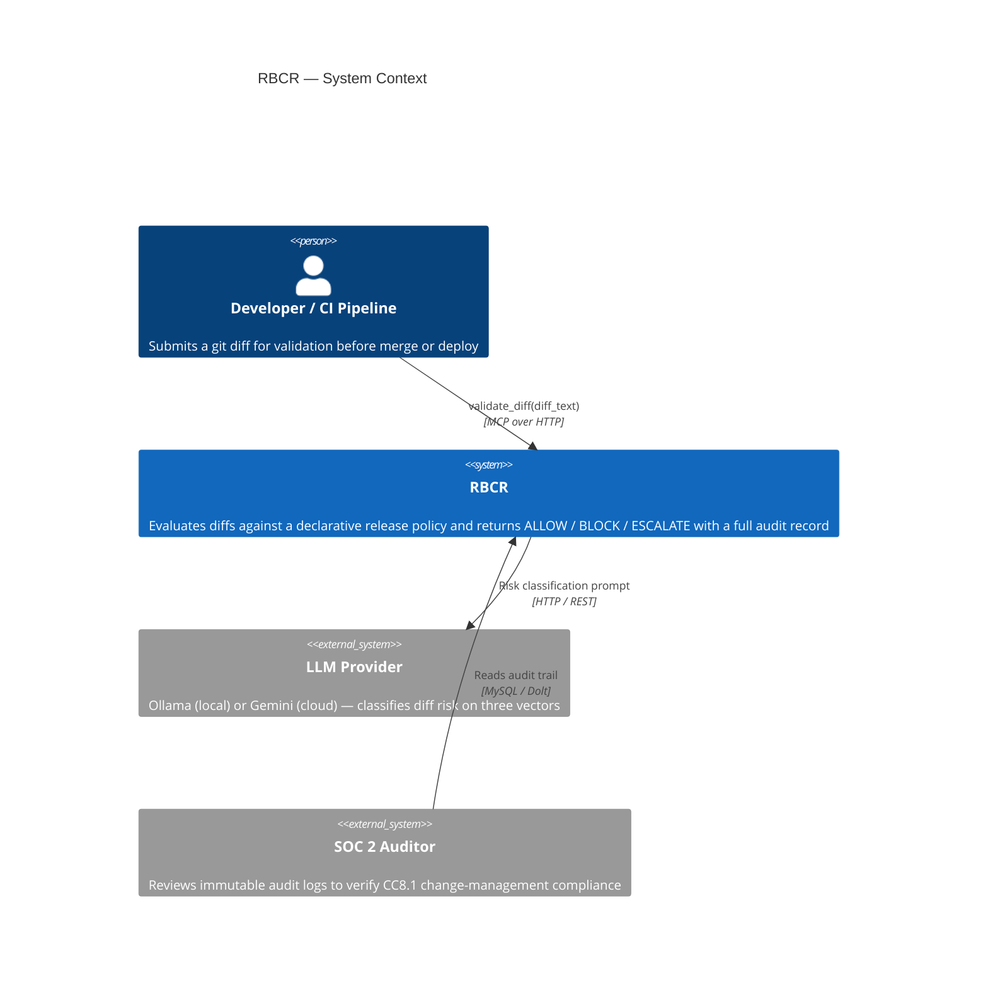
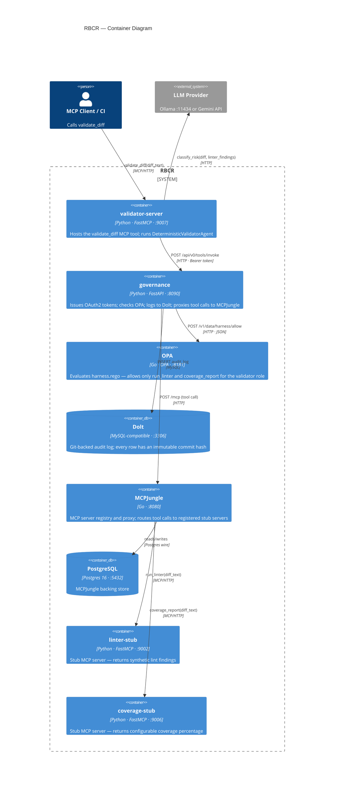
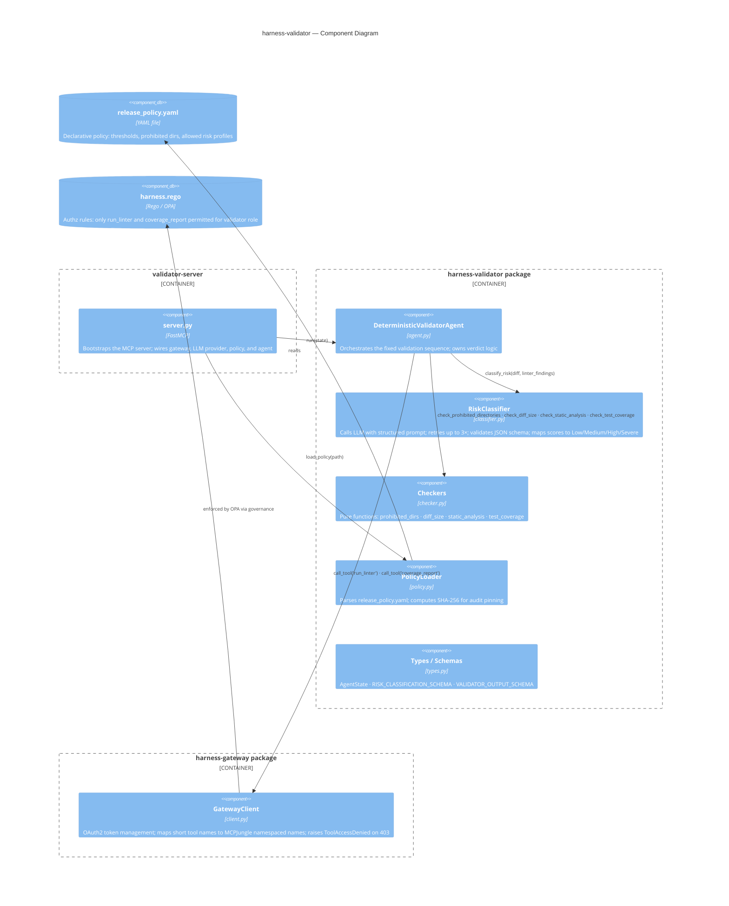

# Architecture — Release Branch Code Review (RBCR)

## Overview

RBCR is a release-gating harness that evaluates code diffs against a versioned declarative policy before they can ship. It combines deterministic rule enforcement with LLM-based risk classification and writes an immutable audit record for every decision.

The design principle is **policy-as-code over human approval**: humans govern the policy document; the system executes it deterministically at machine speed.

---

## Technology Choices

| Component | Technology | Rationale |
|---|---|---|
| Validator server | [FastMCP](https://github.com/jlowin/fastmcp) | Exposes `validate_diff` as an MCP tool — lets any MCP-aware CI pipeline call it without a custom client |
| Governance API | [FastAPI](https://fastapi.tiangolo.com/) | OAuth2 client-credentials token issuance + tool-invocation proxy; async-native, minimal overhead |
| Policy enforcement | [OPA](https://www.openpolicyagent.org/) (Rego) | Decouples authz rules from application code; hot-reloads policy without restart; industry-standard for fine-grained allow/deny |
| Audit log | [Dolt](https://github.com/dolthub/dolt) | Git-backed MySQL — every row is immutable and carries a content-addressable commit hash, which is exactly what SOC 2 CC8.1 auditors need |
| Tool registry | [MCPJungle](https://github.com/mcpjungle/mcpjungle) | Central MCP server registry; governance proxies tool calls through it so tool URLs are never hardcoded in the agent |
| Registry DB | PostgreSQL 16 | MCPJungle backing store |
| LLM inference | Ollama (`qwen2.5-coder:7b`) / Gemini 2.5 Flash | Switchable via `LLM_PROVIDER` env var; Ollama for local/offline, Gemini for cloud; used only for risk classification, not for generating code |
| Language | Python 3.14 | Single language across all services; `asyncio` throughout |
| Package manager | [uv](https://github.com/astral-sh/uv) | Workspace-aware, significantly faster than pip/poetry |
| Container runtime | Docker Compose | Full local stack in one command (`make stack-up`) |
| Testing | pytest + AsyncMock | Three tiers: unit (no I/O), eval (YAML fixtures + mock LLM), integration (live Docker stack) |

---

## C4 Diagrams

### Level 1 — System Context



---

### Level 2 — Containers



---

### Level 3 — Components (harness-validator package)



---

## Request Flow

The agent executes a **fixed, non-negotiable sequence** — there is no dynamic tool selection:

```
MCP client
  │  validate_diff(diff_text)
  ▼
validator-server :9007          ← FastMCP
  │  DeterministicValidatorAgent.run(state)
  │
  ├─ 1. check_prohibited_directories  → BLOCK immediately (no I/O)
  │
  ├─ 2. governance :8090 → OPA → MCPJungle → linter-stub :9002
  │      run_linter(diff_text)          → lint findings
  │
  ├─ 3. LLM  →  risk score (data_surface · integration_depth · vulnerability_surface)
  │      map_to_risk_profile()          → Low | Medium | High | Severe
  │
  ├─ 4. High / Severe ──────────────────────────────────────► ESCALATE
  │
  ├─ 5. governance → MCPJungle → coverage-stub :9006
  │      coverage_report(diff_text)     → coverage %
  │
  ├─ 6. check_diff_size                 → BLOCK if > 350 lines
  ├─ 7. check_static_analysis           → BLOCK if CRITICAL or HIGH lint finding
  └─ 8. check_test_coverage             → BLOCK if < 90 %
         all pass
           └──────────────────────────────────────────────► ALLOW
```

Every invocation — regardless of verdict — writes one row to the Dolt `audit_log` table containing the policy commit hash, diff line count, timestamp, risk profile, and per-check results.

---

## Policy Layers

Two independent policy documents govern the system:

| File | Engine | Purpose |
|---|---|---|
| `policies/release_policy.yaml` | Python (PolicyLoader) | Business thresholds — diff size, coverage floor, prohibited directories, allowed risk profiles |
| `policies/harness.rego` | OPA | Authorization — which tools the validator role may call; enforced on every governance request |

Separating these layers means a compliance lead can update thresholds in YAML without touching Rego, and a security engineer can tighten tool access in Rego without touching business policy.

---

## Audit Trail

Dolt is a MySQL-compatible database where every commit is content-addressable (like git). The governance service records a row after every tool invocation; the validator agent records the final verdict. The `policy_commit_hash` field in every verdict is the SHA-256 of the YAML bytes at load time, giving auditors a cryptographic link between the decision and the exact policy version that produced it.

---

## Deployment

```
make stack-up    # docker compose up — opa, dolt, postgres, mcpjungle,
                 #   governance, linter-stub, coverage-stub, validator-server
                 #   + three register-* init containers (MCPJungle registration)
make stack-down  # tears down + removes volumes
make test        # unit + eval (no Docker required)
```
