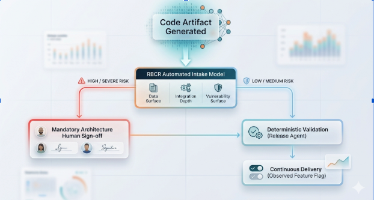

# The Case for AI-Native Compliance: Beyond the Pull Request

The software engineering discipline is colliding with a stark mathematical reality: AI coding agents generate pull requests at a velocity that completely outpaces human review capacity. We call this the Velocity Paradox. When code generation speed scales nonlinearly while human cognitive throughput remains fixed by biological constraints, traditional peer review processes break down.

When review queues become unmanageable, peer reviews degenerate into perfunctory checkbox exercises. Ironically, the manual gate designed to protect security and compliance postures ends up eroding them.

The core bottleneck isn't an engineering inconvenience—it is a governance failure. Many engineering organizations remain paralyzed because they believe passing a SOC 2 audit requires a human eye on every single line of code.

It does not.

SOC 2 Trust Services Criteria (specifically CC8.1) requires organizations to operate authorization boundaries, change management policies, and baseline verifications. It does not mandate that a human must manually click "Approve" on a routine minor dependency or a simple documentation refactor. By decoupling process compliance from manual code review, we can design an automated, highly auditable compliance posture built for AI-scale development.

## The Flaw of the Line-by-Line Heuristic

The traditional Pull Request (PR) review is an outdated proxy for safety. Line-by-line manual inspection assumes that the reviewer has full cognitive context of the entire codebase and can spot subtle runtime vulnerabilities or architectural regressions just by reading text.

Skepticism toward AI-generated output is backed by rigorous data. Recent formal verification studies analyzing code artifacts from leading frontier LLMs reveal an average vulnerability rate of roughly 55%. Because AI-generated code is frequently "broken by default," relying on a human engineer to spot an unhandled integer overflow or a cryptographic flaw in a massive, multi-file diff is statistically indefensible.

Manual PR review is no longer a robust security measure; it is an unscalable heuristic. We must move away from pattern-based human guessing and shift toward automated mathematical certainty, runtime isolation, and policy-driven compliance gates.

## The Risk-Based Triage Matrix (RBCR)

To prevent automated pipelines from introducing systemic risk, engineering organizations must implement a Risk-Based Code Review (RBCR) cadence. Rather than treating an API routing overhaul the same as a color change on a button, changes should be automatically triaged through a classification intake model—such as the AI Security Governance Workbook framework—evaluating three core vectors:

1. Data Surface: Does this code interact with PII, financial ledgers, or health records?
    
2. Integration Depth: Does this change modify third-party webhooks, IAM permissions, or network boundaries?
    
3. Vulnerability Surface: Does it rewrite database query logic, cryptographic modules, or authentication flows?
    


  

When a change is classified as High or Severe Risk, the automated pipeline immediately blocks and escalates the artifact to a mandatory human architectural review. Conversely, Low or Medium Risk changes bypass the manual queue entirely and are routed to automated validation engines.

## Shifting Governance from Code to Policy

Instead of forcing engineers to police individual PR lines, human governance must move upstream. Humans should govern the policies that define acceptable code, while automated engines execute those policies deterministically.

This model splits compliance enforcement into two distinct software layers:

### 1. The Declarative Policy Engine

This layer defines the rigid mathematical and procedural boundaries for what can be deployed. It is written in plain text, version-controlled, and signed off by engineering and compliance leads.


```markdown
# Policy: Release Agent Policy v2.4  
# Approved: 2026-05-18 by E. Vance (VP Engineering) & M. Ross (Compliance Lead)  
  
- AllowedRiskProfiles: [Low, Medium]  
- MaximumDiffLines: 350  
- RequireTestCoverage: ">= 85%"  
- ProhibitedDirectories: ["/src/auth", "/src/billing", "/kubernetes/iam"]  
- StaticAnalysisThreshold: "Zero Critical, Zero High Vulnerabilities"  
```
  

### 2. The Release Agent Gate

The Release Agent is a deterministic binary gate embedded in the CI/CD pipeline—not a generative AI hallucinating code fixes. It evaluates the incoming code artifact against the Declarative Policy.

If the automated intake flags the code as Low Risk, the test suite achieves 90% coverage, and security scanners show zero vulnerabilities, the Release Agent merges and deploys the change automatically.

Crucially, the Release Agent enforces that the change is deployed behind an intelligent feature flag and treated as an observable runtime primitive. This allows the active observability fabric (such as Dynatrace or Datadog) to monitor real-time telemetry and trigger an autonomous rollback within seconds if performance baselines deviate.

## Generating Irrefutable Audit Trails

When an auditor evaluates your organization for SOC 2 CC8.1, they look for a reliable, continuous chain of custody showing that your production changes match approved criteria.

The automated model generates an incredibly dense, clean audit trail compared to messy human PR comments. For every automated deployment, the CI/CD pipeline compiles a structured compliance cryptographic log containing:

- The exact commit hash of the Declarative Policy active at that second.
    
- The cryptographic signatures of the engineering and compliance leaders who signed off on that policy version.
    
- The full execution logs of the test suites, vulnerability scanners, and automated triage scores.
    
- The feature flag configuration showing runtime containment.
    

When the auditor samples fifty changes, you do not hand them fifty links to disorganized GitHub discussions where an engineer typed "LGTM 👍". Instead, you hand them an immutable data dump proving that 100% of those changes conformed perfectly to a mathematically verified, executive-approved deployment policy.

## The Evolving Role of the Human Engineer

This approach does not eliminate the human software engineer; it elevates them.

Instead of burning engineering hours staring at hundreds of repetitive lines of AI-generated syntax, senior engineers transition to System Auditors. Their cognitive bandwidth is redirected to evaluating Decision Traces—analyzing where the AI models are introducing novel architectural patterns versus repeating stale paradigms, and maintaining the organization’s SKILL.md or centralized rule configurations. Humans focus entirely on system architecture, threat modeling, and high-risk validations where contextual intuition is irreplaceable.

The standard does not need to change before this work begins. The compliance frameworks already accommodate this flexibility. Moving to an AI-native compliance model means transforming your security apparatus from a slow, bureaucratic human checkpoint into a high-throughput framework that gives your engineering organization the structural confidence to move fast safely.
